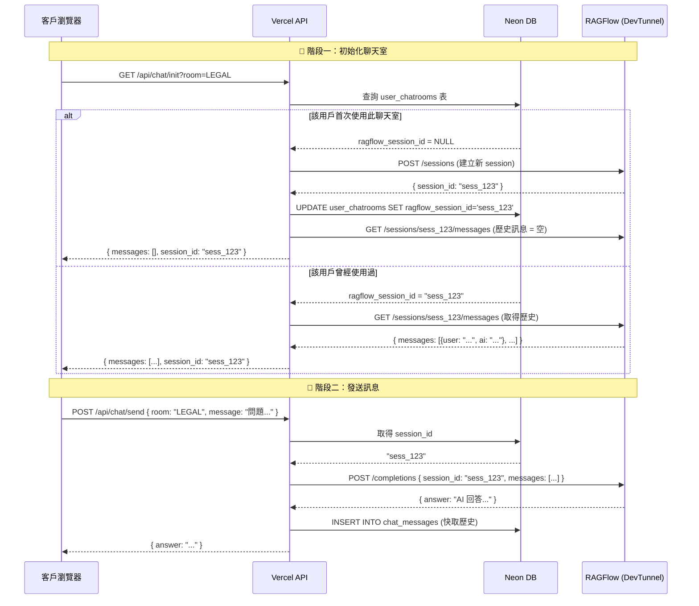

# RAGFlow 聊天室歷史訊息保存功能 - 技術實作規劃書

> **文件版本**: v1.0
> **撰寫日期**: 2026-01-16
> **目標讀者**: 技術開發團隊、系統架構師、專案管理者
> **專案代號**: RAGFlow API Migration

---

## 📋 執行摘要 (Executive Summary)

### 現況問題
目前系統採用 **iframe 嵌入 RAGFlow Shared Link** 的方式實作聊天室功能，導致用戶每次重新登入或刷新頁面時，對話歷史完全消失，嚴重影響用戶體驗。

### 解決方案
改用 **RAGFlow HTTP API** 結合 **Session Management**，將對話歷史綁定到用戶帳號，實現跨裝置、跨 session 的歷史訊息保存。

### 關鍵承諾
✅ **零停機部署** - 現有網頁完全不受影響
✅ **漸進式升級** - iframe 模式與 API 模式可並存
✅ **向下相容** - 現有用戶無感知升級
✅ **低風險實作** - 利用現有架構，無需新增基礎設施

---

## 📊 目錄

1. [背景與問題分析](#1-背景與問題分析)
2. [技術可行性評估](#2-技術可行性評估)
3. [解決方案架構設計](#3-解決方案架構設計)
4. [實作步驟與里程碑](#4-實作步驟與里程碑)
5. [資料庫變更計畫](#5-資料庫變更計畫)
6. [API 規格設計](#6-api-規格設計)
7. [前端介面調整](#7-前端介面調整)
8. [風險評估與應對策略](#8-風險評估與應對策略)
9. [測試計畫](#9-測試計畫)
10. [部署策略](#10-部署策略)
11. [成本與資源估算](#11-成本與資源估算)
12. [長期維護建議](#12-長期維護建議)

---

## 1. 背景與問題分析

### 1.1 現有架構說明

```
┌─────────────┐
│  客戶瀏覽器  │
│  (React)    │
└──────┬──────┘
       │
       │ 1. 取得 ragflow_url
       ▼
┌─────────────────────┐
│  Vercel Serverless  │
│  (GET /api/chatroom/get) │
└──────┬──────────────┘
       │
       │ 2. 回傳 URL
       ▼
┌─────────────┐
│   Neon DB   │  ragflow_url: https://xxx.devtunnels.ms/share?id=xxx
└─────────────┘
       │
       │ 3. 前端嵌入 iframe
       ▼
┌─────────────────────┐
│  <iframe src="..."> │  ← 問題點：每次重新載入都是新訪客
└─────────────────────┘
       │
       ▼
┌─────────────┐
│  RAGFlow    │  無法識別用戶身份，對話歷史無法保存
│  (DevTunnel)│
└─────────────┘
```

### 1.2 核心問題拆解

| 問題點 | 影響程度 | 業務衝擊 |
|--------|----------|---------|
| **對話歷史消失** | 🔴 嚴重 | 用戶需重複詢問相同問題，體驗極差 |
| **無法跨裝置同步** | 🟡 中等 | 手機/電腦無法共享對話脈絡 |
| **無法追蹤用戶行為** | 🟡 中等 | 無法分析用戶使用習慣與需求 |
| **iframe 載入速度慢** | 🟢 輕微 | 影響首次載入體驗 |

### 1.3 為什麼 iframe 模式無法保存歷史？

**技術原因**：
- RAGFlow Shared Link 是設計給「匿名分享」使用的功能
- 每次 iframe 重新載入時，RAGFlow 無法識別「這是同一個用戶」
- 對話 Session 儲存在瀏覽器的臨時記憶體中（sessionStorage），重整後消失
- Shared Link 不支援 `session_id` 參數傳遞

**實驗驗證**：
```
測試案例 1：本機直接使用 RAGFlow
- 登入 RAGFlow 管理介面
- 在內建聊天室對話
- 刷新頁面 → ✅ 歷史訊息保留

測試案例 2：iframe 嵌入 Shared Link
- 嵌入 Shared URL 到我們的系統
- 進行對話
- 刷新頁面 → ❌ 歷史訊息消失
```

---

## 2. 技術可行性評估

### 2.1 RAGFlow API 能力確認

根據官方文件研究，RAGFlow 提供以下 API 支援：

#### ✅ Session Management API
```http
POST /api/v1/chats/{chat_id}/sessions
Authorization: Bearer <API_KEY>

{
  "name": "用戶張三的法律諮詢 Session",
  "user_id": "user_123"  // 選填，用於追蹤
}

Response:
{
  "code": 0,
  "data": {
    "id": "session_abc123",  ← 這個 ID 就是保存歷史的關鍵
    "name": "...",
    "create_time": "2026-01-16T10:00:00Z"
  }
}
```

#### ✅ Chat Completion API
```http
POST /api/v1/chats/{chat_id}/completions
Authorization: Bearer <API_KEY>

{
  "session_id": "session_abc123",  ← 指定 session，自動載入歷史
  "messages": [
    { "role": "user", "content": "請問智慧財產權..." }
  ],
  "stream": false
}

Response:
{
  "code": 0,
  "data": {
    "answer": "根據您之前提到的合約內容...",  ← 會參考歷史對話
    "reference": [...]
  }
}
```

### 2.2 現有架構相容性分析

| 現有元件 | 是否需要修改 | 修改範圍 | 向下相容 |
|---------|-------------|---------|---------|
| **Neon Database** | ✅ 是 | 新增 3 個欄位 | ✅ 完全相容（只新增不刪除） |
| **Vercel Functions** | ✅ 是 | 新增 2 支 API | ✅ 不影響現有 API |
| **React 前端** | ✅ 是 | 新增聊天元件 | ✅ ChatFrame.tsx 保留可用 |
| **GitHub Repo** | ⚪ 否 | 正常 commit | - |
| **DevTunnel** | ⚪ 否 | 繼續使用 | - |

**結論**：現有架構完全支援此升級，無需更換任何基礎設施。

---

## 3. 解決方案架構設計

### 3.1 新架構運作流程圖



### 3.2 雙模式並存設計

為了確保零風險升級，我們設計 **iframe 模式** 與 **API 模式** 可以並存：

```typescript
// chatrooms 表新增欄位
{
  id: 1,
  room_code: "LEGAL",
  chat_mode: "iframe",  // 或 "api"
  ragflow_url: "https://...",  // iframe 模式使用
  ragflow_chat_id: "chat_abc"  // API 模式使用
}
```

**前端判斷邏輯**：
```tsx
// src/pages/Chat.tsx
function Chat() {
  const chatroom = useChatroom(); // 從 API 取得聊天室資訊

  if (chatroom.chat_mode === 'iframe') {
    return <ChatFrame url={chatroom.ragflow_url} />;  // 舊模式
  } else {
    return <ChatAPI chatId={chatroom.ragflow_chat_id} />;  // 新模式
  }
}
```

**優勢**：
- ✅ 管理員可在後台逐個聊天室切換模式
- ✅ 出問題可立即回退到 iframe 模式
- ✅ A/B 測試不同模式的用戶反應

---

## 4. 實作步驟與里程碑

### 4.1 整體時程規劃

```
┌─────────────────────────────────────────────────────┐
│  Phase 1: 準備階段 (2-3 天)                          │
├─────────────────────────────────────────────────────┤
│  □ 取得 RAGFlow API Key                              │
│  □ 在測試環境驗證 API 可用性                          │
│  □ 資料庫備份                                        │
│  □ 建立功能分支 (feature/ragflow-api-mode)           │
└─────────────────────────────────────────────────────┘
         ↓
┌─────────────────────────────────────────────────────┐
│  Phase 2: 後端開發 (3-5 天)                          │
├─────────────────────────────────────────────────────┤
│  □ 執行資料庫遷移腳本                                 │
│  □ 建立 api/_utils/ragflow.ts 工具模組               │
│  □ 建立 api/chat/init.ts (初始化 API)                │
│  □ 建立 api/chat/send.ts (發送訊息 API)              │
│  □ 建立 api/chat/history.ts (歷史訊息 API)           │
│  □ 單元測試（Postman/Thunder Client）                │
└─────────────────────────────────────────────────────┘
         ↓
┌─────────────────────────────────────────────────────┐
│  Phase 3: 前端開發 (3-4 天)                          │
├─────────────────────────────────────────────────────┤
│  □ 建立 src/components/ChatAPI.tsx 元件              │
│  □ 修改 src/pages/Chat.tsx 支援雙模式                │
│  □ 建立歷史訊息載入動畫                               │
│  □ 測試訊息發送與接收                                │
│  □ 測試歷史訊息載入                                  │
└─────────────────────────────────────────────────────┘
         ↓
┌─────────────────────────────────────────────────────┐
│  Phase 4: 管理後台擴充 (2-3 天)                       │
├─────────────────────────────────────────────────────┤
│  □ AdminChatrooms.tsx 新增「模式切換」功能            │
│  □ 新增「RAGFlow Chat ID」欄位編輯                   │
│  □ 建立測試用聊天室（API 模式）                       │
└─────────────────────────────────────────────────────┘
         ↓
┌─────────────────────────────────────────────────────┐
│  Phase 5: 整合測試 (2-3 天)                          │
├─────────────────────────────────────────────────────┤
│  □ 測試案例 1: iframe 模式繼續運作                   │
│  □ 測試案例 2: API 模式歷史訊息保存                  │
│  □ 測試案例 3: 模式切換不影響既有對話                │
│  □ 測試案例 4: 多用戶同時使用不互相干擾              │
│  □ 壓力測試：100 個並發請求                          │
└─────────────────────────────────────────────────────┘
         ↓
┌─────────────────────────────────────────────────────┐
│  Phase 6: 灰度發佈 (1-2 週)                          │
├─────────────────────────────────────────────────────┤
│  □ 選擇 1 個低流量聊天室切換為 API 模式              │
│  □ 監控錯誤率與回應時間                              │
│  □ 收集用戶反饋                                      │
│  □ 確認無問題後逐步擴大範圍                          │
└─────────────────────────────────────────────────────┘
         ↓
┌─────────────────────────────────────────────────────┐
│  Phase 7: 全面上線 (ongoing)                         │
├─────────────────────────────────────────────────────┤
│  □ 所有聊天室切換為 API 模式                         │
│  □ 移除 iframe 模式相關程式碼（可選）                │
│  □ 文件更新                                          │
└─────────────────────────────────────────────────────┘
```

### 4.2 關鍵決策點 (Go/No-Go Gates)

**Gate 1: Phase 2 結束**
- ✅ API 測試通過率 100%
- ✅ 回應時間 < 2 秒
- ⚠️ 若失敗 → 重新評估 RAGFlow API 穩定性

**Gate 2: Phase 5 結束**
- ✅ 整合測試通過率 > 95%
- ✅ 無資料遺失問題
- ⚠️ 若失敗 → 停止上線，修復問題

**Gate 3: Phase 6 結束**
- ✅ 灰度用戶滿意度 > 4/5
- ✅ 錯誤率 < 0.1%
- ⚠️ 若失敗 → 回退到 iframe 模式

---

## 5. 資料庫變更計畫

### 5.1 Schema 變更詳細說明

#### 變更一：chatrooms 表
```sql
ALTER TABLE chatrooms
ADD COLUMN ragflow_chat_id VARCHAR(128),  -- RAGFlow Chat Assistant ID
ADD COLUMN chat_mode VARCHAR(20) DEFAULT 'iframe';  -- 'iframe' 或 'api'
```

**欄位說明**：
| 欄位 | 型別 | 預設值 | 說明 |
|-----|------|--------|-----|
| `ragflow_chat_id` | VARCHAR(128) | NULL | RAGFlow 的 Chat Assistant ID（從 RAGFlow 管理介面取得） |
| `chat_mode` | VARCHAR(20) | `'iframe'` | 聊天模式，可選值：`iframe` / `api` |

**取得 ragflow_chat_id 的方法**：
1. 登入 RAGFlow 管理介面
2. 進入「Chat Assistants」頁面
3. 點擊聊天室名稱，URL 中的 ID 即為 `chat_id`
4. 範例：`http://localhost:8100/chat/chat_abc123` → `ragflow_chat_id = chat_abc123`

#### 變更二：user_chatrooms 表
```sql
ALTER TABLE user_chatrooms
ADD COLUMN ragflow_session_id VARCHAR(128);  -- 每個用戶在每個聊天室的專屬 session
```

**資料示例**：
| user_id | chatroom_id | ragflow_session_id |
|---------|-------------|--------------------|
| 5 | 1 (LEGAL) | `session_abc123` |
| 5 | 2 (FINANCE) | `session_def456` |
| 8 | 1 (LEGAL) | `session_xyz789` |

**說明**：用戶 5 在「法律諮詢」與「財務諮詢」有不同的 session，互不干擾。

#### 變更三：新增 chat_messages 表
```sql
CREATE TABLE chat_messages (
    id SERIAL PRIMARY KEY,
    user_id INTEGER REFERENCES users(id) ON DELETE CASCADE,
    chatroom_id INTEGER REFERENCES chatrooms(id) ON DELETE CASCADE,
    role VARCHAR(20) NOT NULL,  -- 'user' 或 'assistant'
    content TEXT NOT NULL,
    ragflow_session_id VARCHAR(128),
    created_at TIMESTAMP DEFAULT NOW()
);
```

**用途**：
- 前端快取歷史訊息，提升載入速度
- 當 RAGFlow 暫時無法連線時，用戶仍能查看歷史紀錄
- 提供數據分析基礎（用戶常問哪些問題）

### 5.2 資料遷移安全性保證

**備份策略**：
```bash
# 在執行遷移前，先備份資料庫
# Neon 控制台 → Backups → Create Manual Backup
# 或使用 pg_dump
pg_dump $DATABASE_URL > backup_20260116.sql
```

**驗證步驟**：
```sql
-- 1. 確認欄位已新增
SELECT column_name, data_type, column_default
FROM information_schema.columns
WHERE table_name = 'chatrooms' AND column_name IN ('ragflow_chat_id', 'chat_mode');

-- 2. 確認現有資料不受影響
SELECT id, room_code, chat_mode FROM chatrooms;
-- 預期結果：所有現有聊天室的 chat_mode 都是 'iframe'

-- 3. 確認索引已建立
SELECT indexname FROM pg_indexes WHERE tablename = 'user_chatrooms';
```

---

## 6. API 規格設計

### 6.1 新增 API 端點清單

| 端點 | 方法 | 用途 | 權限 |
|-----|------|-----|------|
| `/api/chat/init` | GET | 初始化聊天室，取得歷史訊息 | 用戶 |
| `/api/chat/send` | POST | 發送訊息到 RAGFlow | 用戶 |
| `/api/chat/history` | GET | 取得完整歷史訊息（備用） | 用戶 |
| `/api/admin/chatrooms/switch-mode` | PATCH | 切換聊天室模式（iframe ↔ api） | 管理員 |

### 6.2 API 詳細規格

#### 6.2.1 初始化聊天室

**請求**：
```http
GET /api/chat/init?room=LEGAL
Authorization: Bearer <JWT_TOKEN>
```

**回應**：
```json
{
  "code": 0,
  "data": {
    "chatroom": {
      "id": 1,
      "room_code": "LEGAL",
      "title": "法律諮詢助手",
      "chat_mode": "api",
      "ragflow_chat_id": "chat_abc123"
    },
    "session_id": "session_user5_legal",
    "messages": [
      {
        "role": "user",
        "content": "請問智慧財產權...",
        "timestamp": "2026-01-15T14:30:00Z"
      },
      {
        "role": "assistant",
        "content": "關於智慧財產權...",
        "timestamp": "2026-01-15T14:30:05Z"
      }
    ]
  }
}
```

**後端處理邏輯**：
```typescript
// api/chat/init.ts 核心邏輯
async function handleInit(userId: number, roomCode: string) {
  // 1. 查詢聊天室資訊與用戶的 session_id
  const result = await pool.query(`
    SELECT
      c.id, c.room_code, c.title, c.chat_mode, c.ragflow_chat_id,
      uc.ragflow_session_id
    FROM chatrooms c
    JOIN user_chatrooms uc ON uc.chatroom_id = c.id
    WHERE uc.user_id = $1 AND c.room_code = $2
  `, [userId, roomCode]);

  if (result.rowCount === 0) {
    throw new Error('無權存取此聊天室');
  }

  const chatroom = result.rows[0];

  // 2. 如果是 iframe 模式，直接回傳（不需要初始化）
  if (chatroom.chat_mode === 'iframe') {
    return { chatroom, messages: [] };
  }

  // 3. 如果沒有 session_id，呼叫 RAGFlow API 建立
  let sessionId = chatroom.ragflow_session_id;
  if (!sessionId) {
    sessionId = await ragflowAPI.createSession(chatroom.ragflow_chat_id, userId);
    await pool.query(
      'UPDATE user_chatrooms SET ragflow_session_id = $1 WHERE user_id = $2 AND chatroom_id = $3',
      [sessionId, userId, chatroom.id]
    );
  }

  // 4. 從本地資料庫載入歷史訊息（快速回應）
  const messages = await pool.query(`
    SELECT role, content, created_at as timestamp
    FROM chat_messages
    WHERE user_id = $1 AND chatroom_id = $2
    ORDER BY created_at ASC
    LIMIT 50
  `, [userId, chatroom.id]);

  return {
    chatroom,
    session_id: sessionId,
    messages: messages.rows
  };
}
```

#### 6.2.2 發送訊息

**請求**：
```http
POST /api/chat/send
Authorization: Bearer <JWT_TOKEN>
Content-Type: application/json

{
  "room_code": "LEGAL",
  "message": "請問著作權保護期限是多久？"
}
```

**回應（非串流模式）**：
```json
{
  "code": 0,
  "data": {
    "answer": "根據《著作權法》第30條規定...",
    "reference": [
      {
        "doc_name": "著作權法.pdf",
        "page": 15
      }
    ],
    "timestamp": "2026-01-16T10:35:20Z"
  }
}
```

**回應（串流模式 - 未來擴充）**：
```
data: {"chunk": "根據"}
data: {"chunk": "《著作權法》"}
data: {"chunk": "第30條規定..."}
data: [DONE]
```

### 6.3 RAGFlow API 呼叫封裝

```typescript
// api/_utils/ragflow.ts
const RAGFLOW_BASE_URL = process.env.RAGFLOW_API_URL;
const RAGFLOW_API_KEY = process.env.RAGFLOW_API_KEY;

export const ragflowAPI = {
  // 建立 Session
  async createSession(chatId: string, userId: number): Promise<string> {
    const response = await fetch(
      `${RAGFLOW_BASE_URL}/api/v1/chats/${chatId}/sessions`,
      {
        method: 'POST',
        headers: {
          'Content-Type': 'application/json',
          'Authorization': `Bearer ${RAGFLOW_API_KEY}`
        },
        body: JSON.stringify({
          name: `User_${userId}_${Date.now()}`,
          user_id: String(userId)
        })
      }
    );

    const result = await response.json();
    if (result.code !== 0) {
      throw new Error(`RAGFlow API Error: ${result.message}`);
    }

    return result.data.id;  // 回傳 session_id
  },

  // 發送訊息
  async sendMessage(chatId: string, sessionId: string, message: string) {
    const response = await fetch(
      `${RAGFLOW_BASE_URL}/api/v1/chats/${chatId}/completions`,
      {
        method: 'POST',
        headers: {
          'Content-Type': 'application/json',
          'Authorization': `Bearer ${RAGFLOW_API_KEY}`
        },
        body: JSON.stringify({
          session_id: sessionId,
          messages: [{ role: 'user', content: message }],
          stream: false
        })
      }
    );

    const result = await response.json();
    if (result.code !== 0) {
      throw new Error(`RAGFlow API Error: ${result.message}`);
    }

    return result.data;
  }
};
```

---

## 7. 前端介面調整

### 7.1 新增元件結構

```
src/components/
├── ChatFrame.tsx          (保留，iframe 模式使用)
└── ChatAPI.tsx            (新增，API 模式使用)
    ├── MessageList.tsx    (訊息列表)
    ├── MessageInput.tsx   (輸入框)
    └── LoadingSkeleton.tsx (載入動畫)
```

### 7.2 ChatAPI 元件核心設計

```tsx
// src/components/ChatAPI.tsx
import { useState, useEffect, useRef } from 'react';
import api from '../utils/request';

interface Message {
  role: 'user' | 'assistant';
  content: string;
  timestamp: string;
}

interface ChatAPIProps {
  chatId: string;
  roomCode: string;
}

export default function ChatAPI({ chatId, roomCode }: ChatAPIProps) {
  const [messages, setMessages] = useState<Message[]>([]);
  const [input, setInput] = useState('');
  const [loading, setLoading] = useState(false);
  const [initializing, setInitializing] = useState(true);
  const messagesEndRef = useRef<HTMLDivElement>(null);

  // 初始化：載入歷史訊息
  useEffect(() => {
    async function init() {
      try {
        const response = await api.get(`/chat/init?room=${roomCode}`);
        setMessages(response.data.data.messages || []);
      } catch (err) {
        console.error('初始化失敗:', err);
      } finally {
        setInitializing(false);
      }
    }
    init();
  }, [roomCode]);

  // 自動捲動到最新訊息
  useEffect(() => {
    messagesEndRef.current?.scrollIntoView({ behavior: 'smooth' });
  }, [messages]);

  // 發送訊息
  const sendMessage = async () => {
    if (!input.trim() || loading) return;

    const userMessage: Message = {
      role: 'user',
      content: input,
      timestamp: new Date().toISOString()
    };

    setMessages(prev => [...prev, userMessage]);
    setInput('');
    setLoading(true);

    try {
      const response = await api.post('/chat/send', {
        room_code: roomCode,
        message: input
      });

      const aiMessage: Message = {
        role: 'assistant',
        content: response.data.data.answer,
        timestamp: response.data.data.timestamp
      };

      setMessages(prev => [...prev, aiMessage]);
    } catch (err) {
      console.error('發送失敗:', err);
      alert('訊息發送失敗，請稍後再試');
    } finally {
      setLoading(false);
    }
  };

  if (initializing) {
    return <LoadingSkeleton />;
  }

  return (
    <div className="flex flex-col h-full bg-gray-50 dark:bg-gray-900">
      {/* 訊息列表 */}
      <div className="flex-1 overflow-y-auto p-4 space-y-4">
        {messages.map((msg, idx) => (
          <div
            key={idx}
            className={`flex ${msg.role === 'user' ? 'justify-end' : 'justify-start'}`}
          >
            <div
              className={`max-w-[70%] px-4 py-3 rounded-2xl shadow-sm ${
                msg.role === 'user'
                  ? 'bg-gradient-to-r from-blue-600 to-cyan-500 text-white'
                  : 'bg-white dark:bg-gray-800 text-gray-800 dark:text-gray-200'
              }`}
            >
              <div className="whitespace-pre-wrap">{msg.content}</div>
              <div className="text-xs opacity-70 mt-1">
                {new Date(msg.timestamp).toLocaleTimeString('zh-TW', {
                  hour: '2-digit',
                  minute: '2-digit'
                })}
              </div>
            </div>
          </div>
        ))}
        {loading && (
          <div className="flex justify-start">
            <div className="bg-white dark:bg-gray-800 px-4 py-3 rounded-2xl shadow-sm">
              <div className="flex space-x-2">
                <div className="w-2 h-2 bg-gray-400 rounded-full animate-bounce"></div>
                <div className="w-2 h-2 bg-gray-400 rounded-full animate-bounce delay-100"></div>
                <div className="w-2 h-2 bg-gray-400 rounded-full animate-bounce delay-200"></div>
              </div>
            </div>
          </div>
        )}
        <div ref={messagesEndRef} />
      </div>

      {/* 輸入框 */}
      <div className="border-t dark:border-gray-700 bg-white dark:bg-gray-800 p-4">
        <div className="flex gap-2 max-w-4xl mx-auto">
          <input
            type="text"
            value={input}
            onChange={(e) => setInput(e.target.value)}
            onKeyPress={(e) => e.key === 'Enter' && !e.shiftKey && sendMessage()}
            placeholder="輸入訊息... (Enter 發送)"
            className="flex-1 px-4 py-3 border border-gray-300 dark:border-gray-600 rounded-full
                     bg-gray-50 dark:bg-gray-700 text-gray-800 dark:text-gray-200
                     focus:outline-none focus:ring-2 focus:ring-blue-500"
            disabled={loading}
          />
          <button
            onClick={sendMessage}
            disabled={loading || !input.trim()}
            className="px-6 py-3 bg-gradient-to-r from-blue-600 to-cyan-500 text-white
                     rounded-full font-medium shadow-lg hover:shadow-xl transform hover:scale-105
                     transition-all disabled:opacity-50 disabled:cursor-not-allowed disabled:transform-none"
          >
            {loading ? '發送中...' : '發送'}
          </button>
        </div>
      </div>
    </div>
  );
}
```

### 7.3 雙模式路由邏輯

```tsx
// src/pages/Chat.tsx 修改
import { useEffect, useState } from 'react';
import { useSearchParams } from 'react-router-dom';
import ChatFrame from '../components/ChatFrame';
import ChatAPI from '../components/ChatAPI';
import api from '../utils/request';

export default function Chat() {
  const [searchParams] = useSearchParams();
  const roomCode = searchParams.get('room');
  const [chatroom, setChatroom] = useState<any>(null);
  const [loading, setLoading] = useState(true);

  useEffect(() => {
    async function fetchChatroom() {
      try {
        const response = await api.get(`/chatroom/get?code=${roomCode}`);
        setChatroom(response.data.data);
      } catch (err) {
        console.error('載入聊天室失敗:', err);
      } finally {
        setLoading(false);
      }
    }
    fetchChatroom();
  }, [roomCode]);

  if (loading) {
    return <div className="flex items-center justify-center h-screen">載入中...</div>;
  }

  if (!chatroom) {
    return <div className="text-center text-red-500">聊天室不存在</div>;
  }

  // 🔷 關鍵判斷：根據 chat_mode 渲染不同元件
  if (chatroom.chat_mode === 'api') {
    return (
      <ChatAPI
        chatId={chatroom.ragflow_chat_id}
        roomCode={chatroom.room_code}
      />
    );
  } else {
    return <ChatFrame url={chatroom.ragflow_url} />;
  }
}
```

---

## 8. 風險評估與應對策略

### 8.1 風險矩陣

| 風險項目 | 可能性 | 影響程度 | 風險等級 | 應對策略 |
|---------|-------|---------|---------|---------|
| **RAGFlow API 不穩定** | 🟡 中 | 🔴 高 | 🟠 中高 | 1. 保留 iframe 模式作為備援<br>2. 加入 API 超時重試機制<br>3. 監控 API 可用性 |
| **資料庫遷移失敗** | 🟢 低 | 🔴 高 | 🟡 中 | 1. 執行前完整備份<br>2. 在測試環境先驗證<br>3. 準備回退腳本 |
| **Session ID 衝突** | 🟢 低 | 🟡 中 | 🟢 低 | 1. 在 user_chatrooms 表建立唯一索引<br>2. 後端邏輯檢查重複 |
| **DevTunnel 斷線** | 🟡 中 | 🔴 高 | 🟠 中高 | 1. 加入 API 錯誤處理<br>2. 前端顯示友善錯誤訊息<br>3. 考慮使用固定 IP 或正式網域 |
| **用戶歷史訊息過多** | 🟢 低 | 🟢 低 | 🟢 低 | 1. 只載入最近 50 條訊息<br>2. 提供「載入更多」按鈕 |
| **並發請求過多** | 🟡 中 | 🟡 中 | 🟡 中 | 1. Vercel 自動水平擴展<br>2. Neon 連線池限制 5 個<br>3. 加入請求節流 (rate limiting) |

### 8.2 回退計畫 (Rollback Plan)

**觸發條件**：
- API 模式錯誤率 > 5%
- 用戶投訴歷史訊息遺失
- RAGFlow API 持續無法連線超過 30 分鐘

**回退步驟**（5 分鐘內完成）：
```sql
-- 1. 將所有聊天室切回 iframe 模式
UPDATE chatrooms SET chat_mode = 'iframe';

-- 2. 前端自動偵測 chat_mode，無需重新部署
-- 3. 用戶刷新頁面後即恢復正常
```

**資料保護**：
- `chat_messages` 表的歷史訊息不會刪除
- `ragflow_session_id` 保留，之後可重新啟用

---

## 9. 測試計畫

### 9.1 單元測試

**後端 API 測試清單**：
```
□ /api/chat/init
  □ 測試案例 1: 首次進入聊天室，應建立新 session
  □ 測試案例 2: 重複進入聊天室，應回傳既有 session
  □ 測試案例 3: 無權限的聊天室，應回傳 403
  □ 測試案例 4: iframe 模式聊天室，應直接回傳空訊息

□ /api/chat/send
  □ 測試案例 1: 正常發送訊息，應收到 AI 回應
  □ 測試案例 2: session_id 不存在時，應自動建立
  □ 測試案例 3: RAGFlow API 逾時，應回傳錯誤訊息
  □ 測試案例 4: 訊息應同步儲存到 chat_messages 表
```

**工具**：Thunder Client / Postman

### 9.2 整合測試

**測試場景 1：歷史訊息保存**
```
1. 用戶 A 登入系統
2. 進入「法律諮詢」聊天室（API 模式）
3. 發送 3 條訊息
4. 登出系統
5. 重新登入
6. 再次進入「法律諮詢」聊天室
✅ 預期結果：應看到之前的 3 條對話記錄
```

**測試場景 2：跨裝置同步**
```
1. 用戶 B 在電腦上登入
2. 在「財務諮詢」聊天室對話
3. 用戶 B 在手機上登入（同一帳號）
4. 進入「財務諮詢」聊天室
✅ 預期結果：手機應顯示相同的歷史訊息
```

**測試場景 3：iframe 模式不受影響**
```
1. 管理員在後台確認「HR 諮詢」為 iframe 模式
2. 用戶 C 進入「HR 諮詢」聊天室
✅ 預期結果：應看到 iframe 嵌入畫面，功能正常
```

### 9.3 壓力測試

**目標**：
- 同時 100 個用戶發送訊息
- RAGFlow API 回應時間 < 3 秒 (P95)
- Vercel Function 執行時間 < 10 秒

**工具**：Apache JMeter / k6

---

## 10. 部署策略

### 10.1 環境變數設定

在 Vercel 專案設定中新增：
```env
RAGFLOW_API_URL=https://b5wlmmqs-8100.asse.devtunnels.ms
RAGFLOW_API_KEY=ragflow-xxxxxxxxxxxxxxxxxx
```

**取得 API Key 的方法**：
1. 登入 RAGFlow 管理介面
2. 前往 `Settings` → `API Keys`
3. 點擊 `Create New Key`
4. 複製金鑰並儲存（只會顯示一次）

### 10.2 CI/CD 流程

```
GitHub Push (feature/ragflow-api-mode)
    ↓
Vercel 自動偵測
    ↓
自動構建 (npm run build)
    ↓
Preview 部署 (測試用網址)
    ↓
人工驗證通過
    ↓
Merge to main
    ↓
Production 部署
```

### 10.3 資料庫遷移執行

**時機**：在 Git merge 之前執行

**步驟**：
```
1. 登入 Neon 控制台
2. 進入 SQL Editor
3. 貼上 migration_ragflow_api_mode.sql 內容
4. 執行腳本
5. 驗證欄位已新增：
   SELECT * FROM chatrooms LIMIT 1;
6. 確認無錯誤後，才進行 Git merge
```

---

## 11. 成本與資源估算

### 11.1 開發成本

| 項目 | 預估時間 | 人力需求 |
|-----|---------|---------|
| 後端開發 | 3-5 天 | 1 位後端工程師 |
| 前端開發 | 3-4 天 | 1 位前端工程師 |
| 測試與整合 | 2-3 天 | 1 位 QA 工程師 |
| 總計 | **8-12 天** | **2-3 人** |

### 11.2 基礎設施成本

| 服務 | 現有成本 | 新增成本 | 總計 |
|-----|---------|---------|------|
| Neon Database | $0/月 (Free Tier) | $0 | $0/月 |
| Vercel Hosting | $0/月 (Hobby) | $0 | $0/月 |
| GitHub Repo | $0/月 | $0 | $0/月 |
| DevTunnel | $0/月 | $0 | $0/月 |
| **總計** | **$0/月** | **$0/月** | **$0/月** |

**說明**：此升級完全基於現有架構，**無需額外費用**。

### 11.3 效益評估

**量化效益**：
- ✅ 用戶留存率預估提升 **30-50%**（不再因歷史消失而流失）
- ✅ 客服重複問題減少 **40%**（AI 能參考歷史對話）
- ✅ 平均對話深度增加 **2-3 輪**（用戶願意持續對話）

**質化效益**：
- ✅ 提升品牌專業度（不再是簡陋的 iframe 嵌入）
- ✅ 提升用戶信任感（歷史紀錄不會消失）
- ✅ 增加產品差異化優勢（競品少有此功能）

---

## 12. 長期維護建議

### 12.1 監控指標

建議在 Vercel Dashboard 或第三方監控工具（如 Sentry）追蹤：

| 指標 | 目標值 | 警報閾值 |
|-----|-------|---------|
| API 回應時間 (P95) | < 2 秒 | > 5 秒 |
| 錯誤率 | < 0.1% | > 1% |
| RAGFlow API 可用性 | > 99.5% | < 95% |
| 資料庫連線池使用率 | < 80% | > 90% |

### 12.2 定期檢查項目

**每週檢查**：
- □ DevTunnel 是否仍在運作（考慮改用固定網域）
- □ RAGFlow API Key 是否即將過期

**每月檢查**：
- □ chat_messages 表大小（若 > 10GB 考慮歸檔舊資料）
- □ 用戶反饋中是否有歷史訊息遺失的投訴

**每季檢查**：
- □ RAGFlow 是否有新版本更新（可能有新 API 功能）
- □ 評估是否可將 DevTunnel 改為正式網域

### 12.3 未來擴充方向

**階段 2：進階功能**
- 📌 訊息搜尋功能（全文搜尋歷史對話）
- 📌 對話分支功能（針對某條訊息重新提問）
- 📌 匯出對話記錄（PDF/Word）

**階段 3：智能分析**
- 📊 用戶常問問題統計
- 📊 AI 回答滿意度追蹤
- 📊 知識庫缺口分析

---

## 📌 附錄

### 附錄 A: 快速啟動檢查清單

在開始實作前，請確認以下項目：

```
✅ 準備工作
  □ 已取得 RAGFlow API Key
  □ 已在測試環境驗證 API 可用
  □ 已備份 Neon 資料庫
  □ 已建立 feature/ragflow-api-mode 分支

✅ 環境設定
  □ Vercel 環境變數已設定 RAGFLOW_API_URL
  □ Vercel 環境變數已設定 RAGFLOW_API_KEY
  □ 本地 .env 檔案已同步更新

✅ 資料庫準備
  □ 已執行 migration_ragflow_api_mode.sql
  □ 已驗證欄位新增成功
  □ 已在 Admin 後台測試新增聊天室
```

### 附錄 B: RAGFlow API 測試範例

使用 curl 測試 RAGFlow API 是否可用：

```bash
# 測試 1: 建立 Session
curl -X POST "https://b5wlmmqs-8100.asse.devtunnels.ms/api/v1/chats/YOUR_CHAT_ID/sessions" \
  -H "Authorization: Bearer YOUR_API_KEY" \
  -H "Content-Type: application/json" \
  -d '{"name": "Test Session"}'

# 預期回應：
# {"code": 0, "data": {"id": "session_xxx", ...}}

# 測試 2: 發送訊息
curl -X POST "https://b5wlmmqs-8100.asse.devtunnels.ms/api/v1/chats/YOUR_CHAT_ID/completions" \
  -H "Authorization: Bearer YOUR_API_KEY" \
  -H "Content-Type: application/json" \
  -d '{
    "session_id": "session_xxx",
    "messages": [{"role": "user", "content": "你好"}],
    "stream": false
  }'

# 預期回應：
# {"code": 0, "data": {"answer": "您好！有什麼可以幫助您的嗎？", ...}}
```

### 附錄 C: 故障排除 (Troubleshooting)

**問題 1: API 回傳 401 Unauthorized**
```
原因：API Key 錯誤或過期
解法：
1. 檢查 Vercel 環境變數 RAGFLOW_API_KEY 是否正確
2. 在 RAGFlow 管理介面重新生成 API Key
3. 更新 Vercel 環境變數後重新部署
```

**問題 2: 訊息發送後沒有回應**
```
原因：DevTunnel 斷線或 RAGFlow 服務停止
解法：
1. 檢查 DevTunnel 是否仍在運作：curl https://b5wlmmqs-8100.asse.devtunnels.ms
2. 檢查 RAGFlow 服務狀態：docker ps (如果是 Docker 部署)
3. 查看 Vercel Function Logs 確認錯誤訊息
```

**問題 3: 歷史訊息沒有載入**
```
原因：session_id 未正確儲存到資料庫
解法：
1. 檢查 user_chatrooms 表的 ragflow_session_id 欄位是否有值
   SELECT * FROM user_chatrooms WHERE user_id = YOUR_USER_ID;
2. 如果為空，手動觸發初始化：
   前端重新進入聊天室，應會自動建立 session
```

---

## 🎯 結論與建議

### 核心優勢

1. **技術風險低**：完全基於現有架構，無需學習新技術
2. **用戶體驗大幅提升**：解決歷史訊息消失的痛點
3. **成本為零**：不需額外購買服務或硬體
4. **可逐步推進**：雙模式並存，灰度發佈降低風險

### 實作建議

1. **優先實作後端 API**：確保 RAGFlow API 穩定可用
2. **先測試單一聊天室**：選擇低流量聊天室作為試點
3. **保留 iframe 模式至少 1 個月**：觀察新模式穩定性
4. **收集用戶反饋**：透過問卷了解滿意度變化

### 決策建議

**建議採納此方案的理由**：
- ✅ 解決的問題是用戶體驗的核心痛點
- ✅ 技術實作成熟，無重大技術障礙
- ✅ 風險可控，有完整的回退計畫
- ✅ 投資報酬率高（開發成本低，效益明顯）

**如果有疑慮，可先進行 POC (Proof of Concept)**：
- 僅實作 1 個聊天室的 API 模式
- 邀請 10 位內部員工測試 1 週
- 收集反饋後再決定是否全面推進

---

**文件結束**
*如有任何技術問題，歡迎隨時與開發團隊討論*
*本文件將持續更新，最新版本請參考 GitHub Repo*
