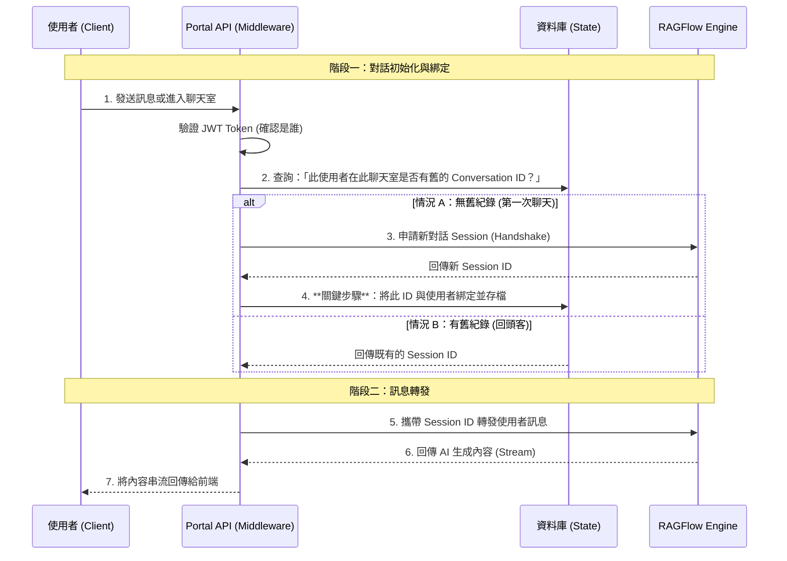

# 技術架構提案書：RAGFlow API 整合邏輯與工作流 (v3.0 - 邏輯版)

> **版本：** v3.0
> **目標讀者：** 資深系統架構師 / 工程團隊
> **核心宗旨：** 闡述由 Iframe 轉向 API Proxy 模式的系統互動邏輯與資料流設計。

---

## 1. 架構核心變更 (Architectural Shift)

本提案旨在改變「使用者與 AI 對話」的連線拓樸與狀態管理方式，以解決對話紀錄保存問題。

*   **現狀 (Iframe 模式)**：
    *   **連線**：User Browser 直接連線至 RAGFlow Server。
    *   **缺點**：RAGFlow 無法識別 Portal 的使用者身分，因此視為匿名訪客，每次重整 Session 即重置。
*   **提案 (API Proxy 模式)**：
    *   **連線**：User Browser 僅連線至 **Portal API**​​，由 Portal API 代為轉發至 RAGFlow。
    *   **優點**：Portal API 掌握「使用者身分」與「對話 ID」的對應關係，確保對話紀錄持久化。

---

## 2. 系統互動工作流 (Workflow Logic)

透過 **BFF (Backend for Frontend)** 模式，將 Portal API 作為唯一的對外窗口。

### 核心時序圖 (Interaction Flow)

---

## 3. 關鍵邏輯說明 (Key Logic Description)

### A. 狀態管理 (State Management)
*   **問題**: RAGFlow 是無狀態的 (Stateless)，還是依賴 Client Cookie？
*   **策略**: 我們將狀態管理責任**上移至 Portal 資料庫**。
*   **實作邏輯**:
    *   並非依賴瀏覽器的 Cookie，而是依賴資料庫中的 `Mapping Table`。
    *   每次 API 請求進來，系統必須執行 **Lookup (查找)** 動作：`Map(UserID, RoomID) -> ConversationID`。
    *   只要 UserID 不變，取出的 ConversationID 就不變，RAGFlow 就會認定是同一場對話。

### B. 安全性與鑑權 (Security & Auth)
*   **雙重屏障**:
    1.  **第一層 (User -> Portal)**: 維持現有的 JWT Access Token 機制，確保只有登入的合法用戶能呼叫 API。
    2.  **第二層 (Portal -> RAGFlow)**: 使用 RAGFlow Admin API Key 進行伺服器對伺服器 (S2S) 通訊。
*   **隱密性**: 終端使用者永遠看不到 RAGFlow 的真實 URL 或 API Key，隱藏了後端拓樸。

### C. 部署拓樸 (Network Topology)
*   **Vercel (Cloud)** 需要能夠訪問 **RAGFlow**。
*   若 RAGFlow 部署於本地 (Localhost)，依舊需要透過 Tunnel (如 DevTunnel) 提供公開入口給 Vercel 呼叫。
*   此架構與現有部署方式完全相容，僅改變資料流向。

---

## 4. 預期效益 (Expected Outcome)

1.  **歷史紀錄持久化**: 因為 Conversation ID 被永久記錄在資料庫，使用者即使換電腦登入，API 也能撈出同一個 ID，進而恢復完整的歷史對話。
2.  **介面一致性**: 移除 Iframe 黑盒子後，前端團隊可完全掌控 UI/UX (如字體、配色、Loading 效果)。
3.  **商業邏輯擴充性**: 因為所有訊息都經過 Portal API，未來可在此層加入「計費」、「敏感詞過濾」或「對話分析」等加值功能。

---
*文件日期: 2026/01/16*
