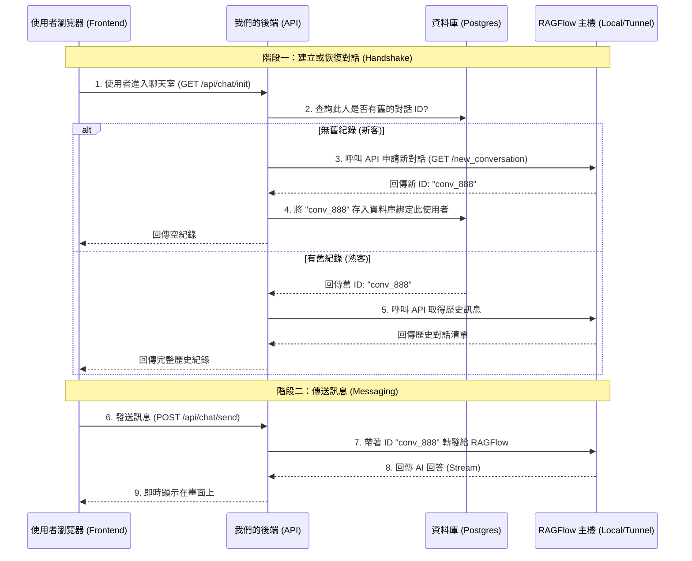

# 技術架構提案書：RAGFlow API 整合轉型計畫 (v1.0)

> **致：** 技術開發團隊 / Tech Lead
> **主旨：** 關於將聊天室架構由前端 Iframe 嵌入轉型為後端 API 代理之提案 (RFC)

## 1. 為什麼要做這個更動？ (Problem & Motivation)

### 現狀問題 (The Pain Point)
目前的聊天室功能是透過在前端嵌入 `<iframe>` (指向 RAGFlow Shared URL) 來實作。
這種方式存在一個致命的體驗缺陷：**「無法保存歷史紀錄」**。
*   RAGFlow 的 Shared Link 機制是無狀態 (Stateless) 的設計，主要用於匿名分享。
*   每當使用者重新整理網頁、或登出再登入，Iframe 都會被視為一個全新的訪客，導致之前的對話紀錄全部消失。
*   這對於需要長期服務客戶的 SaaS 產品來說是無法接受的。

### 改動目標 (The Goal)
我們需要轉向 **API 代理模式 (API Proxy Mode)**。
*   **核心價值**：將對話紀錄的擁有權從「使用者的瀏覽器」轉移到「我們的資料庫」。
*   **預期效果**：使用者帳號 (User ID) 將與 RAGFlow 的對話 ID (Conversation ID) 進行永久綁定。無論使用者何時登入、換裝置，都能看到完整的歷史訊息。

---

## 2. 新架構運作流程 (Proposed Workflow)

為了達成上述目標，我們將採用 **BFF (Backend for Frontend)** 模式，利用現有的 Vercel Serverless Functions 作為中介。

### 核心互動時序圖 (Sequence Diagram)



---

## 3. 具體技術變更 (Technical Specifications)

此提案完全基於現有架構 (Neon + Vercel + GitHub)，無需新增基礎建設。

### A. 資料庫變更 (Schema Changes)
我們需要在現有的 `user_chatrooms` 表中增加一個欄位，用來當作「存根聯」。

```sql
-- 目標：紀錄每個使用者在每個聊天室專屬的 Ragflow ID
ALTER TABLE user_chatrooms ADD COLUMN ragflow_conversation_id VARCHAR(128);

-- 建立索引以加速查詢
CREATE INDEX idx_ragflow_conv_id ON user_chatrooms(ragflow_conversation_id);
```

### B. API 介面規格 (API Specs)
需在 `api/` 目錄下新增一支核心 API。

#### `POST /api/chat/send`
這是前端唯一需要溝通的窗口。
*   **Request**: `{ "room_code": "LEGAL", "message": "請問智慧財產權..." }`
*   **Header**: `Authorization: Bearer <JWT_TOKEN>` (確保安全性)
*   **邏輯**:
    1.  解析 Token 確認是哪位使用者。
    2.  去資料庫拿他的 `ragflow_conversation_id`。
    3.  如果是第一次聊天，先向 RAGFlow 註冊拿 ID 並存檔。
    4.  將訊息轉發給 RAGFlow 並回傳結果。

### C. 前端介面 (Frontend UI)
*   **移除**: `<iframe src="...">`
*   **新增**: 原生 React 聊天組件 (Chat Component)。
    *   好處：完全自定義樣式（配合現有藍色漸層主題）、更快的載入速度、無縫的使用者體驗。

---

## 4. 安全性與連線 (Security & Network)

*   **API Key 保護**：Ragflow 的 Admin Key 只會存在 Vercel 的環境變數中，**絕對不會**暴露給前端使用者。
*   **連線拓樸**：
    *   `Vercel (Cloud)` -> `DevTunnel (Public URL)` -> `Ragflow (Localhost)`
    *   即使 Ragflow 跑在本地，只要維持 DevTunnel 開啟並將網址設定給 Vercel，此架構即可運作。

## 5. 結論 (Conclusion)
這是一個**低風險、高回報**的架構升級。
*   **低風險**：不影響現有的登入、會員管理功能，僅替換聊天視窗的實作。
*   **高回報**：徹底解決歷史紀錄問題，並能提供更專業的產品體驗 (不再依賴 iframe)。

---
*提案日期: 2026/01/16*
*提案人: AI Technical Assistant*
